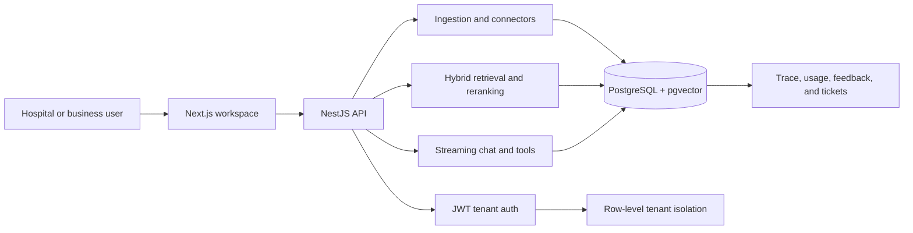

# Aegis RAG

**A production-minded, multi-tenant RAG platform with explainable retrieval.**

Aegis RAG turns client knowledge into a secure, searchable workspace. It is aimed at hospitals, healthcare operations teams, and other regulated or multi-client businesses that need staff to find internal policies, procedures, product documentation, and operational answers with source citations. It combines pgvector semantic search with PostgreSQL full-text search, keeps every tenant isolated at the database layer, and records the retrieval evidence behind each answer.

> Aegis is a technical foundation, not a claim of HIPAA, SOC 2, or other regulatory certification. Production deployments require the organization’s own compliance review and controls.

## Why Aegis

Naive RAG systems fail silently: they retrieve weak context, answer confidently, and leave no way to diagnose the result. Aegis is designed around the operational questions clients actually ask:

- Which source chunks informed this answer?
- Why did this result rank above another one?
- Can one customer ever access another customer's data?
- What does a query cost and how is quality measured over time?

## Current capabilities

- Multi-tenant JWT authentication with tenant identity embedded in verified tokens.
- Prisma data model and Postgres/pgvector migration for documents, chunks, queries, traces, feedback, cache, connectors, and tickets.
- Defense-in-depth tenant isolation: `PrismaService.withTenant()` sets a per-transaction RLS context and every tenant-owned table has a row-level security policy.
- Document upload ingestion for TXT, Markdown, CSV, and JSON; chunks and embeddings persist in Postgres.
- Hybrid retrieval: vector similarity and PostgreSQL full-text search are merged with reciprocal-rank fusion.
- Chat endpoint with source citations, persisted query records, and per-candidate trace data.
- Feedback capture and per-tenant usage aggregates.
- Next.js landing, login, and workspace dashboard shell.
- Docker Compose configuration and GitHub Actions validation workflow.

## Architecture



## Example: hospital policy operations

A hospital uploads clinical operations manuals, HR policies, and incident-response procedures. A staff member searches for an exact policy identifier such as `IPC-104`. Semantic search alone may overlook that identifier; PostgreSQL full-text search catches it, reciprocal-rank fusion combines it with conceptually relevant passages, and reranking promotes the strongest evidence. The answer includes source snippets, while an administrator can inspect the full trace to see the retrieved chunks, scores, reroute events, and latency. If the user asks to file an incident-related bug, Aegis creates a tenant ticket and records the tool action.

This example demonstrates the intended workflow, not regulatory certification. A real hospital deployment still requires organizational security, privacy, retention, and compliance review.

## Stack

- Frontend: Next.js 15, React 19
- API: NestJS 10, Passport JWT
- Persistence: PostgreSQL 16, pgvector, Prisma 6
- Local infrastructure: Docker Compose

## Quick start

```bash
cp .env.example .env
npm install
docker compose up -d postgres
npm run db:migrate
npm run dev:api
```

In a second terminal:

```bash
npm run dev
```

Open `http://localhost:3000`. The API runs at `http://localhost:4000/api`.

For a complete containerized startup, use `docker compose up --build`; the backend applies Prisma migrations automatically before starting.

## Useful endpoints

| Endpoint                      | Purpose                                              |
| ----------------------------- | ---------------------------------------------------- |
| `POST /api/auth/register`     | Create a member in a seeded tenant workspace         |
| `POST /api/auth/login`        | Receive a JWT access token                           |
| `POST /api/documents/upload`  | Ingest a supported document (`multipart/form-data`)  |
| `POST /api/chat`              | Retrieve context and return an answer with citations |
| `GET /api/traces`             | Inspect prior retrieval traces                       |
| `POST /api/feedback/:queryId` | Record thumbs up/down feedback                       |
| `GET /api/usage`              | View tenant query/token aggregates                   |

Authenticated endpoints require `Authorization: Bearer <token>`.

## Quality and security posture

Tenant identity is derived from the verified JWT rather than a caller-supplied header. Each tenant query is executed in a Prisma transaction that sets `app.tenant_id`; PostgreSQL row-level security policies then enforce the same boundary even if a future query omits an application-side filter.

The current local embedding implementation is deterministic, so the project can be explored without an external model key. Provider-backed embeddings, reranking, SSE token streaming, external connector execution, evaluation automation, and the remaining dashboard screens are the next planned increments.

## Validation

```bash
npm run prisma:generate
npm run lint
npm run build
```

## License

This repository is currently unlicensed. Add a license before reuse or distribution.
